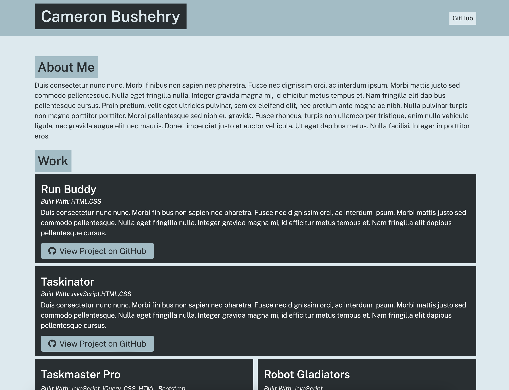

# portfolio-generator

A Node.js application that generates a professional portfolio website from user input. This tool helps users to quickly create a portfolio site to showcase their projects and skills, making it easier to present their work to potential employers or clients.

### Features
- Interactive prompts to gather user information using Inquirer.js
- Automated generation of HTML and CSS files
- Dynamic addition of multiple projects
- Option to include an "About" section

### Prerequisites
- Node.js
- npm

### Installation
1. Clone the repository: 'git clone https://github.com/cbushehry/portfolio-generator.git'
2. Navigate to the project directory: 'cd portfolio-generator'
3. Install the necessary packages: 'npm install'
4. Run the application: 'node app.js'

## Credits / Contact
This application was made by Cameron Bushehry

  
  